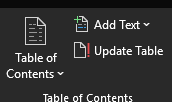
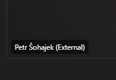

# Contents

[Chapter 1 [1](#chapter-1)](#chapter-1)

[Chapter 1.1 [2](#chapter-1.1)](#chapter-1.1)

[Chapter 1.1.1 [2](#chapter-1.1.1)](#chapter-1.1.1)

# 

# Chapter 1

- A

- B

- C

- D

- A

- B

  - C

- D

  - E

    - F

    - G

- H

1.  A

2.  B

3.  C

4.  D

<!-- -->

1.  A

    1.  B

    2.  C

        1.  D

        2.  E

            1.  F

            2.  G

2.  H

fgsfdgs

| **Column A** | **Column B** | **Column C** |
|--------------|--------------|--------------|
| a            | b            | c            |
| D            | E            | H            |
| G            | I            | K            |

<figure>

<figcaption>
Figure 1. Image A
</figcaption>
</figure>

<figure>

<figcaption>
Figure 2 Image 2
</figcaption>
</figure>

## Chapter 1.1

### Chapter 1.1.1

#### Chapter 1.1.1.1

[link](https://gitlab.ext.cyber.ee/sdmms/sdmms-user-manual/-/tree/main/modules/ROOT/pages)

[link to document](#chapter-1)

Bold and italic example

I added example pages and a **structured** navigation to better demonstrate the technical *possibilities* of what can be achieved. Presented structure is my *personal vision* of how we could be able to provide **logical and easy to use structure for all the activities in the SDMMS**.

New paragraph sadkjhgfkasd hgfouiash dgufhbasiuld ghiuasbg iubasdgbfiausbgq wrpgbipv jabsbviuab sdfuigbqwiurbgfqiuwdsbfvias viuaps vua9sdhbiupasdgfi uasgfiuasd fiuasgdfiugasd iufgasdiuf gasdufgiausfg iuasdgf iuasdgf iausdgfiuasdgf asdfg ai
